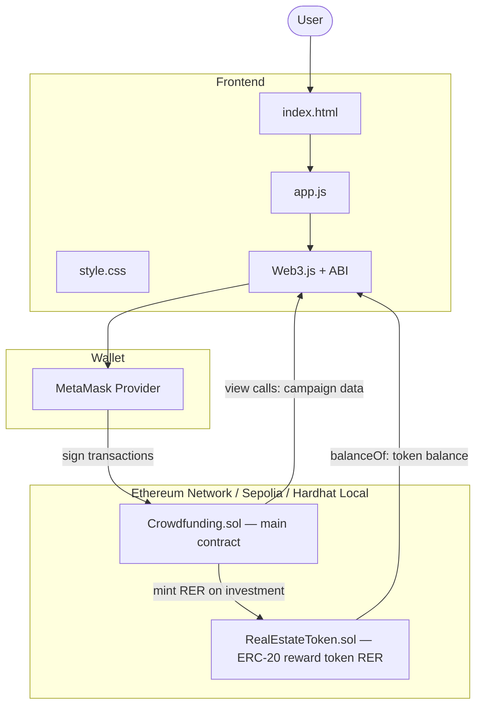

# Estate Token — Real Estate Tokenization & Crowdfunding Platform

A blockchain-based platform for real estate tokenization and crowdfunding. Property owners create fundraising campaigns, and investors acquire fractional ownership through ERC-20 tokens.

## Application Architecture

The application is built on a three-layer architecture:



**Frontend** — a static web application (HTML/CSS/JS) that interacts with the blockchain via the Web3.js library. No backend server is used — all business logic runs in smart contracts on the blockchain.

**MetaMask** — a browser wallet that acts as a provider between the frontend and the Ethereum network. Users sign transactions through it.

**Smart Contracts** — two Solidity contracts deployed on the Ethereum network. `Crowdfunding.sol` handles the core business logic (campaigns, investments, fund withdrawal). `RealEstateToken.sol` is an ERC-20 token that is automatically minted as a reward upon investment.

## Design and Implementation Decisions

### Why Two Contracts Instead of One

The `Crowdfunding` contract manages campaigns and investments, while `RealEstateToken` is a separate ERC-20 token. This separation allows:
- Compliance with the ERC-20 standard via OpenZeppelin, ensuring token compatibility with wallets and exchanges.
- Restricting minting rights — only the `Crowdfunding` contract can call `mint()`, protecting against unauthorized token emission.

### Why On-Chain Property Data Storage

All campaign data (title, location, type, description) is stored directly in the `Campaign` struct on the blockchain. This simplifies the architecture — no IPFS or external database is required, and the frontend reads data directly from the contract.

### Why Web3.js and Vanilla JS Instead of a Framework

The frontend is built with plain HTML/CSS/JavaScript without React/Vue/Angular. This lowers the entry barrier, simplifies deployment (just open `index.html` in a browser), and removes dependencies on bundlers.

### Investment Reward Mechanism

On each investment, the investor receives RER reward tokens using the formula `msg.value * 100` (in wei). This incentivizes participation and gives the investor a tradable ERC-20 asset in addition to their campaign share.

### Deployment Pattern

The `Crowdfunding` contract creates a `RealEstateToken` instance in its constructor (`rewardToken = new RealEstateToken()`). This way, deploying one contract automatically deploys the second, and the `Crowdfunding` address is immediately set as the only authorized minter.

## Smart Contract Logic

### RealEstateToken.sol

An ERC-20 token called "Real Estate Reward" (symbol: RER), built on OpenZeppelin. Only the `Crowdfunding` contract address can mint tokens — this address is set in the constructor as `msg.sender`.

```
constructor() → stores the Crowdfunding contract address (msg.sender)
mint(to, amount) → mints tokens; require(msg.sender == crowdfundingContract)
```

### Crowdfunding.sol

The main platform contract. Stores campaigns in `mapping(uint256 => Campaign)`.

**Campaign struct:**
```
title, location, propertyType, description  — property description
owner               — campaign creator address
totalValue          — fundraising target (in wei)
tokenSupply         — total property token supply
tokensAvailable     — remaining tokens
raisedAmount        — amount raised so far
minInvestment       — minimum investment amount
deadline            — campaign end timestamp
fullyFunded         — fully funded flag
finalized           — funds withdrawn flag
```

**Core functions:**

| Function | Type | Description |
|----------|------|-------------|
| `tokenizeProperty(...)` | write | Creates a campaign with full parameters. Validates input, calculates deadline as `block.timestamp + _duration`. |
| `createCampaign(title, target, duration)` | write | Simplified creation with defaults: 100 tokens, type "Residential", minInvestment = 0.01 ETH. |
| `invest(id)` | payable | Invests ETH. Checks deadline, minimum amount, status. Distributes tokens proportionally: `(msg.value * tokenSupply) / totalValue`. Mints RER reward: `msg.value * 100`. |
| `contribute(id)` | payable | Alternative contribution method without property token distribution, but with RER reward. |
| `withdrawFunds(id)` | write | Owner withdraws funds. Requires: `msg.sender == owner`, `raisedAmount >= totalValue`, `!finalized`. Uses low-level `call` for ETH transfer. |
| `getPropertyCount()` | view | Returns the total number of campaigns. |
| `getPropertyInfo(id)` | view | Returns property description (name, location, type, description, owner). |
| `getPropertyFinancials(id)` | view | Returns financial data (totalValue, tokenSupply, tokensAvailable, raisedAmount, minInvestment, deadline). |
| `getPropertyStatus(id)` | view | Returns status: fullyFunded, ended (deadline passed or finalized), finalized. |
| `getContribution(id, user)` | view | Returns a specific user's contribution to a campaign. |

**Events:**
- `CampaignCreated(id, title, totalValue, deadline)` — emitted on campaign creation
- `ContributionMade(id, contributor, amount)` — emitted on investment
- `FundsWithdrawn(id, amount)` — emitted on fund withdrawal

## Frontend-to-Blockchain Interaction

The frontend (`frontend/app.js`) interacts with the contracts via **Web3.js** and the **MetaMask** wallet using the following flow:

### 1. Wallet Connection

```
User clicks "Connect Wallet"
    → app.js calls window.ethereum.request({ method: 'eth_requestAccounts' })
    → MetaMask shows a confirmation popup
    → app.js receives the account address and creates a Web3 instance
    → Contract objects are created via new web3.eth.Contract(ABI, address)
```

The frontend also subscribes to MetaMask events:
- `accountsChanged` — reloads when the account changes
- `chainChanged` — reloads when the network changes

### 2. Reading Data (View Calls)

To display properties, the frontend makes read-only calls that require no gas or signature:

```
estateContract.methods.getPropertyCount().call()
    → gets the number of campaigns

estateContract.methods.getPropertyInfo(id).call()
estateContract.methods.getPropertyFinancials(id).call()
estateContract.methods.getPropertyStatus(id).call()
    → loads each campaign's data in parallel via Promise.all()

propertyTokenContract.methods.balanceOf(account).call()
    → gets the user's RER token balance
```

### 3. Writing Data (Transactions)

Operations that modify blockchain state require signing via MetaMask:

**Creating a campaign:**
```
estateContract.methods.tokenizeProperty(name, location, type, ...).send({ from: account })
    → MetaMask prompts for transaction confirmation
    → Transaction is recorded on the blockchain
    → Frontend reloads data via loadAllData()
```

**Investing:**
```
estateContract.methods.invest(propertyId).send({ from: account, value: amountWei })
    → ETH is sent to the contract along with the function call
    → Contract distributes tokens and mints RER
    → Frontend updates the progress bar and balances
```

### 4. ABI as the Connecting Layer

`app.js` stores the ABI (Application Binary Interface) of both contracts. The ABI describes function signatures and allows Web3.js to form correct calldata for calling contract methods. Contract addresses are set in the constants `ESTATE_TOKEN_ADDRESS` and `PROPERTY_TOKEN_ADDRESS` — these must be updated after each deployment.

## Deployment and Execution Instructions

### Prerequisites
- Node.js v16+
- MetaMask browser extension

### Installation

```bash
git clone <repo-url>
cd RealEstateTokenization-main

npm install

cp .env.example .env
```

Fill in `.env`:
```
PRIVATE_KEY=your_private_key
INFURA_API_KEY=your_infura_key
```

### Local Deployment

```bash
# Terminal 1 — start local Hardhat blockchain
npx hardhat node

# Terminal 2 — deploy contracts
npx hardhat run scripts/deploy.js --network localhost
```

The deployment script will output both contract addresses. Copy them into `frontend/app.js` (lines 1–2):

```javascript
const ESTATE_TOKEN_ADDRESS = '<Crowdfunding address>';
const PROPERTY_TOKEN_ADDRESS = '<RealEstateToken address>';
```

Open `frontend/index.html` in a browser and connect MetaMask to the `localhost:8545` network (Chain ID: 31337).

### Deploying to Sepolia Testnet

```bash
npx hardhat run scripts/deploy.js --network sepolia
```

Make sure `PRIVATE_KEY` and `INFURA_API_KEY` are set in `.env` and the account has test ETH.

### Running Tests

```bash
npx hardhat test

# With gas report
REPORT_GAS=true npx hardhat test
```

## Obtaining Test ETH

To operate on the Sepolia network, you need test ETH. You can get it from faucets:

1. **Google Cloud Sepolia Faucet** — https://cloud.google.com/application/web3/faucet/ethereum/sepolia
   - No authentication required, up to 0.05 ETH per request.

2. **Alchemy Sepolia Faucet** — https://www.alchemy.com/faucets/ethereum-sepolia
   - Requires an Alchemy account, up to 0.5 ETH per day.

3. **Infura Sepolia Faucet** — https://www.infura.io/faucet/sepolia
   - Requires an Infura account, up to 0.5 ETH per day.

**Steps:**
1. Install MetaMask and switch to the Sepolia Testnet network.
2. Copy your wallet address from MetaMask.
3. Open one of the faucets, paste the address, and request test ETH.
4. Wait for transaction confirmation (usually 15–30 seconds).
5. Test ETH will appear in your MetaMask wallet.

## Project Structure

```
├── contracts/
│   ├── RealEstateToken.sol    # ERC-20 reward token (RER)
│   └── Crowdfunding.sol       # Main crowdfunding contract
├── frontend/
│   ├── index.html             # Main page
│   ├── app.js                 # Blockchain interaction logic + ABI
│   └── style.css              # Styles (responsive design)
├── scripts/
│   └── deploy.js              # Deployment script (Hardhat)
├── test/
│   └── Crowdfunding.test.js   # Contract tests
├── docs/                      # Frontend backup copies
├── hardhat.config.js          # Hardhat config (Solidity 0.8.28, optimizer, networks)
├── .env.example               # Environment variables template
└── package.json               # Project dependencies
```

## Technologies

| Component | Stack |
|-----------|-------|
| Smart Contracts | Solidity 0.8.28, OpenZeppelin v5.4 (ERC-20) |
| Development Framework | Hardhat, Ethers.js v6 |
| Frontend | HTML5, CSS3, JavaScript (vanilla) |
| Blockchain Interaction | Web3.js v1.10 |
| Wallet | MetaMask |
| Networks | Sepolia Testnet, Hardhat Local (localhost:8545) |
| Testing | Mocha, Chai, Hardhat Gas Reporter |
